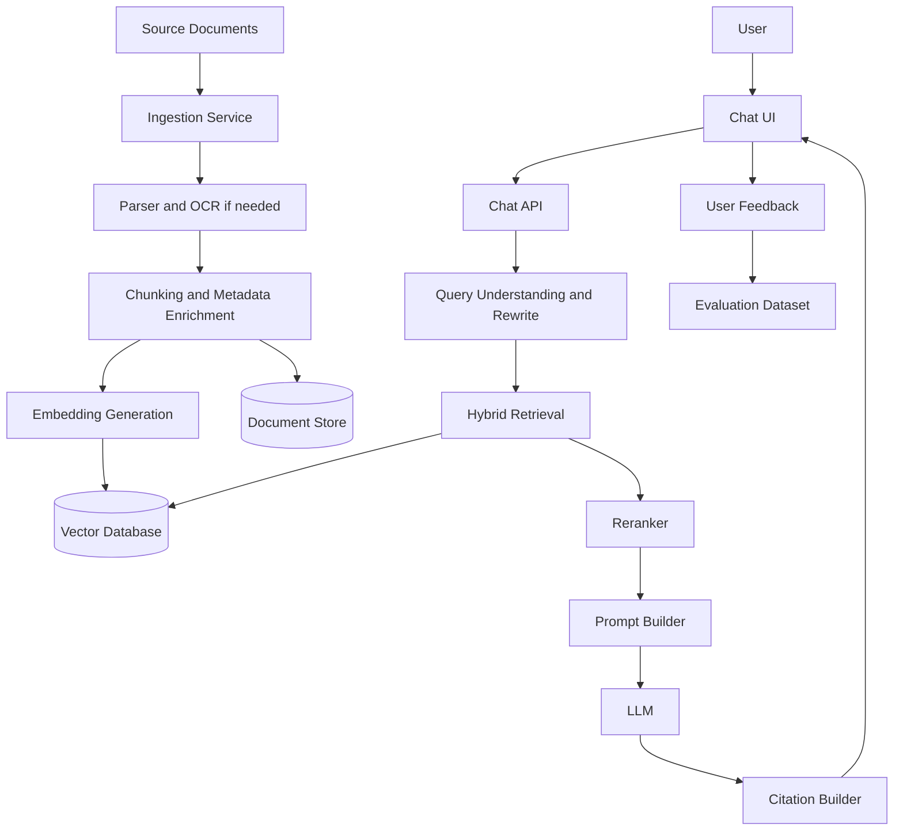

# AI/RAG Architecture Guidance

Use this reference when the project includes AI, chatbots, document search, summarization, recommendation, agent workflows, or automation.

## Required AI architecture areas

Cover:

- LLM provider options
- RAG pipeline
- Document ingestion
- Parsing and OCR if needed
- Chunking strategy
- Metadata enrichment
- Embedding model
- Vector database
- Metadata filtering
- Hybrid retrieval
- Reranking
- Prompt design
- Guardrails
- Citation generation
- Evaluation
- Human feedback loop
- AI quality monitoring
- Hallucination mitigation
- Cost control
- Security and privacy

## AI/RAG diagram

## Design rules

- Use RAG when answers must be grounded in private or changing documents.
- Use citations when the domain is high-trust, regulated, or operationally sensitive.
- Use metadata filters for tenant, role, document type, date, region, and access permissions.
- Keep raw documents in object storage and metadata in a relational database.
- Use vector DB for retrieval, not as the source of truth.
- Separate ingestion from query-time retrieval.
- Add feedback and evaluation from the first production release.
- Add guardrails for prompt injection, data leakage, sensitive information, and unsupported claims.
- Cache retrieval or LLM outputs only when data freshness and permissions allow it.

## Vector database selection

- Qdrant: good open-source/managed balance, strong filtering, good for teams that want control.
- Pinecone: managed and low ops, good for fast production, but cost and lock-in must be considered.
- pgvector: good when scale is moderate and PostgreSQL is already used.
- OpenSearch vector search: good when OpenSearch is already required for search.
- ChromaDB: good for prototyping and local development; evaluate production needs carefully.

## Hallucination mitigation

Recommend:

- Retrieval with strict source grounding
- Citation-backed responses
- Refusal behavior when evidence is insufficient
- Prompt injection detection
- Evaluation datasets
- Human feedback loop
- Answer confidence signals
- Audit logs for prompts, retrieved chunks, and generated answers where policy allows
