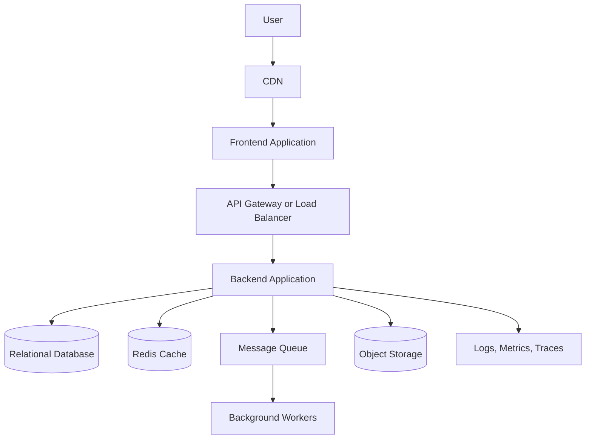

# Architecture Response Template

Use this template when producing the final answer.

## 1. Understanding of the Project

Summarize:

- Business goal
- Target users
- Main workflows
- Core features
- Functional requirements
- Non-functional requirements
- Data and integration requirements
- Security/compliance needs
- Constraints and success criteria

## 2. Key Assumptions

List assumptions explicitly. Example:

```text
Assumptions:
- The first release should prioritize speed of delivery over complex distributed architecture.
- Traffic is expected to grow gradually rather than spike immediately.
- The team wants production readiness but not enterprise multi-region deployment on day one.
```

## 3. Project Size Classification

Classify as one of:

- Small MVP
- Startup Production System
- Mid-size Business Platform
- Enterprise-grade System
- High-scale Distributed System

Explain the classification using users, traffic, domain complexity, data sensitivity, integrations, team size, and availability needs.

## 4. Candidate Architecture Options

Use this table:

| Architecture Option | Pros | Cons | Best Fit | Not Suitable When |
|---|---|---|---|---|
| Monolith | Fast to build, simple deployment, low operational overhead | Can become tightly coupled | Small MVPs | Many teams need independent deployments |
| Modular monolith | Clear module boundaries with simple deployment | Requires discipline to maintain boundaries | MVPs and mid-size platforms | Modules require independent scaling or release cycles |
| Microservices | Independent scaling and deployment, strong ownership boundaries | Higher DevOps complexity, distributed debugging, network failure handling | Large teams and complex domains | Small teams or early MVPs |
| Serverless | Low ops, scales automatically, good for event-driven workloads | Cold starts, vendor lock-in, local testing complexity | Spiky workloads and event processing | Long-running compute or complex orchestration |
| Event-driven | Loose coupling, async processing, resilient workflows | Harder tracing and consistency model | Workflows, integrations, background processing | Simple CRUD apps with low scale |

## 5. Recommended Architecture

Explain:

- Recommended choice
- Why it fits
- Trade-offs
- What to avoid
- How it can evolve later

## 6. High-Level Architecture Diagram

Use Mermaid. Generic example:



## 7. Candidate Technology Stack Analysis

Use `technology-stack-analysis.md`.

## 8. Final Recommended Technology Stack

Use this format:

```text
Recommended stack:
- Frontend:
- Backend:
- Database:
- Cache:
- Search/vector database:
- Messaging/queue:
- Object storage:
- Authentication:
- Cloud provider:
- Deployment:
- CI/CD:
- Monitoring:
```

For every major choice, explain what alternatives were considered and why the recommended option is better for this story.

## 9. Cloud Service Recommendations

Use `cloud-services-map.md`.

## 10. Infrastructure Design

Cover:

- VPC/VNet
- Public and private subnets
- Load balancer/API gateway
- Compute layer
- Database layer
- Cache layer
- Storage layer
- Queue/event bus
- Security groups/firewall rules
- IAM/RBAC
- Secrets
- Backups and disaster recovery
- Dev/staging/production separation

## 11. Database Design

Cover:

- Database type
- Schema approach
- Indexes
- Transaction boundaries
- Migration strategy
- Backup strategy
- Retention
- Multi-tenancy model if needed
- Read/write scaling
- OLTP vs OLAP separation for data-heavy systems

## 12. Security Design

Use this table:

| Security Area | Recommendation | Why |
|---|---|---|
| Authentication |  |  |
| Authorization |  |  |
| API Security |  |  |
| Data Protection |  |  |
| Network Security |  |  |
| Secrets |  |  |
| Audit Logs |  |  |
| CI/CD Security |  |  |

## 13. Scalability and Reliability Design

Use this table:

| Area | Recommendation | Reason |
|---|---|---|
| Scaling backend |  |  |
| Scaling database |  |  |
| Caching |  |  |
| Async workloads |  |  |
| Reliability |  |  |
| Disaster recovery |  |  |

## 14. CI/CD and DevOps Plan

Include branch strategy, tests, security scanning, IaC, artifact build, deployment, rollback, promotion, approvals, and secrets handling.

```mermaid
flowchart LR
    Dev[Developer Push] --> CI[CI Pipeline]
    CI --> Tests[Run Tests]
    Tests --> Scan[Security and Dependency Scan]
    Scan --> Build[Build Artifact or Container]
    Build --> Registry[Container Registry]
    Registry --> DeployStaging[Deploy to Staging]
    DeployStaging --> Approval[Manual Approval]
    Approval --> DeployProd[Deploy to Production]
    DeployProd --> Monitor[Monitor and Alert]
```



## 15. Observability Plan

Use this table:

| Observability Area | Recommendation |
|---|---|
| Logs |  |
| Metrics |  |
| Traces |  |
| Errors |  |
| Audit events |  |
| Dashboards |  |
| Alerts |  |
| SLOs |  |

## 16. Cost Optimization

Use this table:

| Cost Area | Recommendation | Reason |
|---|---|---|
| Compute |  |  |
| Database |  |  |
| Storage |  |  |
| Logging |  |  |
| Networking |  |  |
| AI/LLM usage |  |  |
| Operations |  |  |

## 17. Implementation Roadmap

Use this table:

| Phase | Goal | Key Work | Deliverables |
|---|---|---|---|
| Phase 1: MVP |  |  |  |
| Phase 2: Production Readiness |  |  |  |
| Phase 3: Scaling |  |  |  |
| Phase 4: Enterprise Maturity |  |  |  |

## 18. Risks and Mitigation

Use this table:

| Risk | Impact | Mitigation |
|---|---|---|
| Over-engineering |  |  |
| Vendor lock-in |  |  |
| High cloud cost |  |  |
| Database bottleneck |  |  |
| Security gap |  |  |
| Poor observability |  |  |
| Team skill mismatch |  |  |
| Compliance gap |  |  |

## 19. Final Recommendation

End with:

- Recommended architecture summary
- Recommended stack
- Recommended cloud option
- Recommended implementation phases
- Biggest risks
- Next questions
